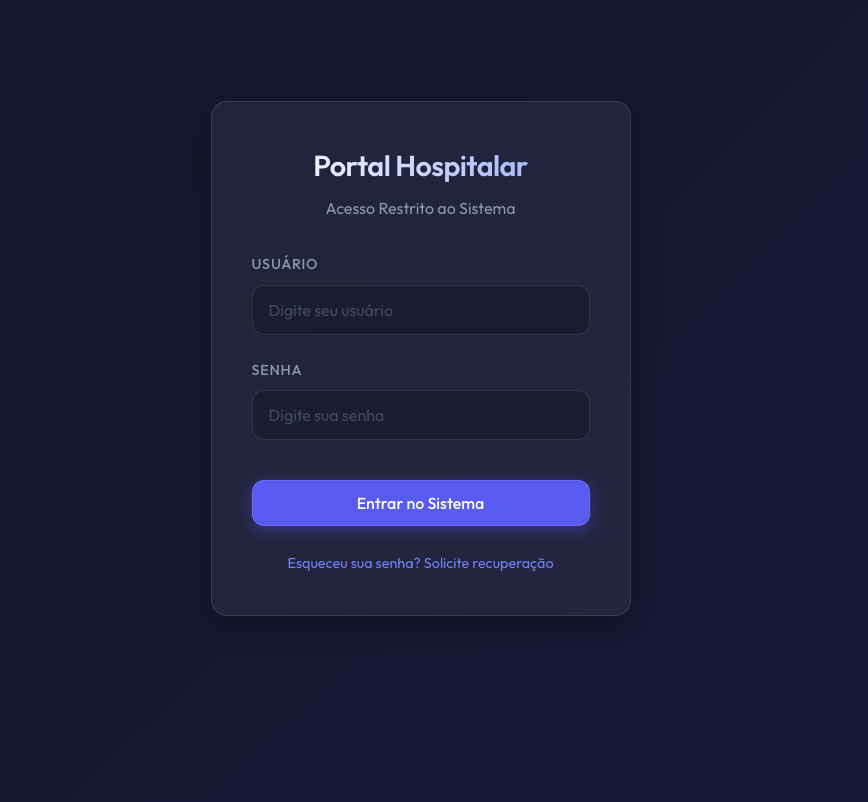
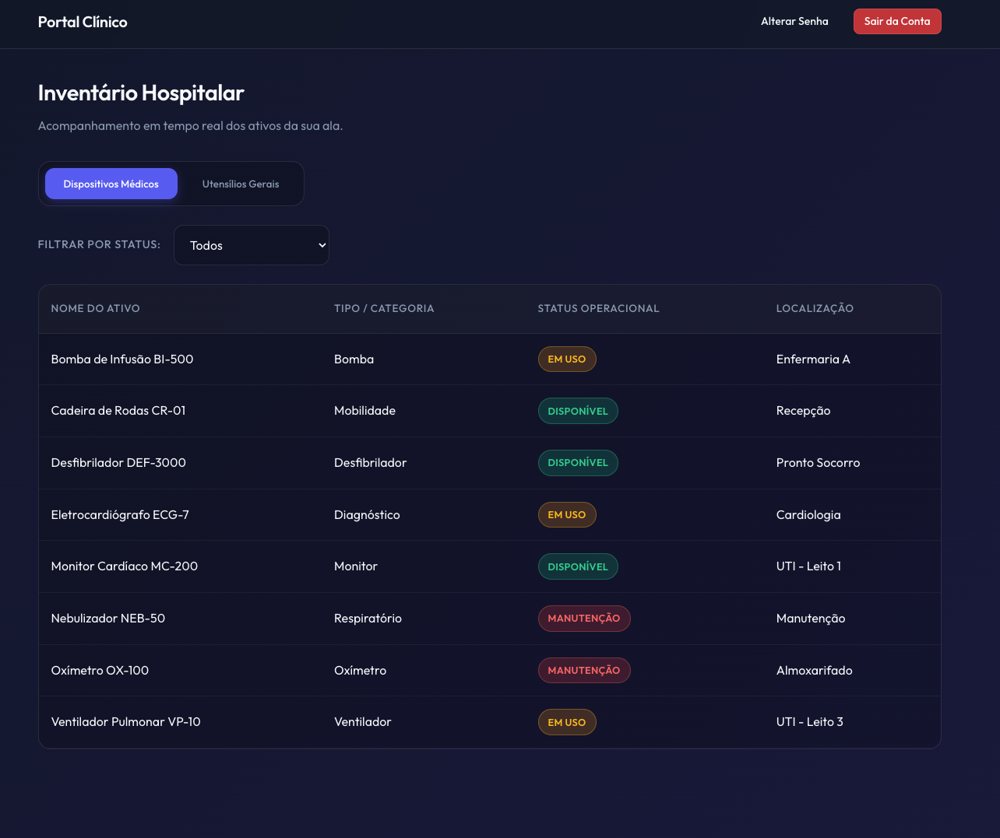
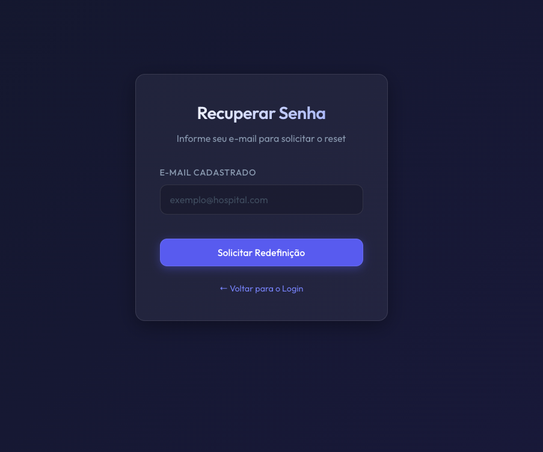
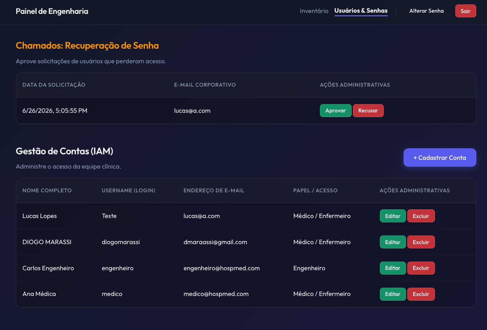
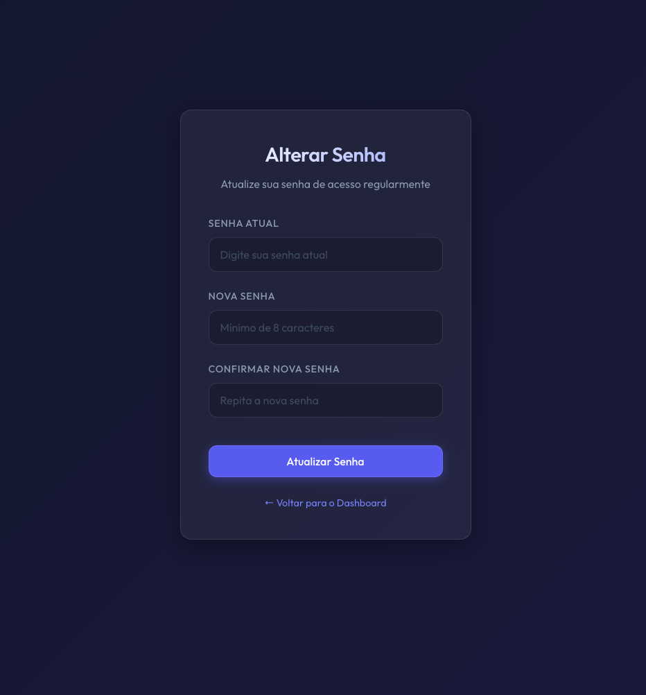

# Sistema de Gerenciamento de Ativos Hospitalares - Frontend

- Lucas Lopes - 2220647
- Diogo Marassi - 2220354

## Links Relevantes
* **Site Frontend (Deploy):** [https://medtrack-lime-five.vercel.app/](https://medtrack-lime-five.vercel.app/)

## Escopo do Projeto
Este projeto é o Frontend do sistema de gerenciamento de dispositivos hospitalares, que atua em conjunto com a nossa API Django.
Ele foi desenvolvido inteiramente com **HTML, CSS e JavaScript (com a base escrita totalmente em TypeScript)**. Não fizemos uso de nenhum framework pesado (como React ou Angular), atendendo à exigência de aplicar os conhecimentos práticos e puristas ensinados em sala de aula (Vanilla JS).

## O que foi desenvolvido
* **Autenticação:** Tela de login assíncrona, consumindo a API REST e gerenciando a sessão e acesso utilizando LocalStorage para o JWT.
* **Dashboards Específicos por Usuário:** 
  * **Painel do Médico:** Visão focada nas necessidades do médico, lidando com chamados e visualização do status do maquinário.
  * **Painel do Engenheiro:** Visão administrativa total com operações CRUD ativas e aba para aprovação de solicitações de troca de senha.
  * *Justificativa:* Cumprimos o requisito de permitir que diferentes usuários tenham visões diferentes do site com base em seu escopo de atuação.
* **Gerência de Senha:** Funcionalidades de "Esqueci minha Senha" via fluxo de chamados.
* **TypeScript:** Uso extenso de tipagem no código-fonte, posteriormente compilado para que os navegadores possam interpretá-lo de forma limpa.

## Como Usar (Fluxo da Aplicação)

### 1. Autenticação (Login)
Ao abrir o site, a primeira visão é a tela de **Login**. Insira suas credenciais para acessar o sistema.



*Credenciais de teste:*
* **Engenheiro (Admin):** `username`: `engenheiro` | `password`: `Admin@12345`
* **Médico:** `username`: `medico` | `password`: `Medico@12345`

### 2. Dashboard Inicial
Uma vez logado, a aplicação dinamicamente identificará qual o seu tipo (Engenheiro ou Médico) e redirecionará para o Dashboard correto, limitando as funções do que você pode e não pode ver.



### 3. Recuperação de Senha (Esqueci a Senha)
Caso esqueça a senha, solicite a redefinição na tela de login informando o seu email. O sistema enviará uma notificação para os administradores.



### 4. Notificações do Administrador
O administrador (Engenheiro) possui uma aba de notificações onde recebe os pedidos de redefinição de senha. Ele pode aceitar ou recusar. Ao aceitar, o sistema exibe uma senha temporária.



### 5. Alteração de Senha
Após fazer login, você pode acessar a funcionalidade de alterar a sua senha a qualquer momento para manter a conta segura.



## Como Instalar e Rodar Localmente

### Pré-requisitos
* Node.js para compilar o frontend (opcional, os arquivos compilados já estão inclusos).
* Python 3 para subir um servidor web local.

### Passos
1. Clone o repositório:
   ```bash
   git clone <LINK_DO_REPO_FRONTEND>
   cd trab2-prog-web-front
   ```

2. Todos os arquivos transpilados do TypeScript já estão embutidos no diretório `dist/`. Basta iniciar um servidor HTTP simples na raiz do projeto:
   ```bash
   # Utilizando Python 3:
   python3 -m http.server 3000
   ```

3. Acesse em seu navegador a URL: `http://localhost:3000/index.html`

## Funcionalidades Testadas (Testes Manuais Realizados)

### O que funcionou (Testado e Aprovado)
* Login nativo com fetch e integração com o Backend 100% funcional.
* Redirecionamento dinâmico entre painéis e proteção das telas (não é possível acessar o dashboard sem autenticação).
* Operações completas de CRUD (Create, Read, Update, Delete) nas tabelas, comunicando-se com o Django em tempo real.
* O fluxo completo de "Esqueci a senha" no front.
* O código TypeScript gerou com sucesso a lógica para a pasta `dist/`, mantendo o HTML totalmente separado (sem poluição no DOM).